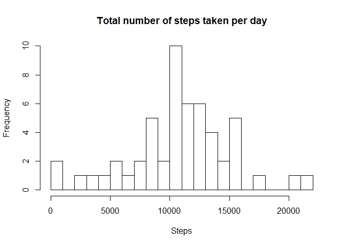
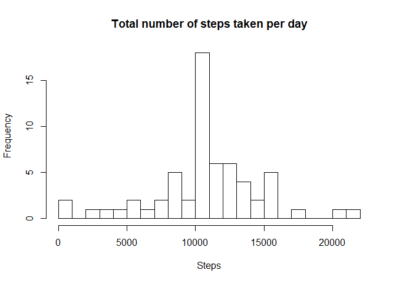
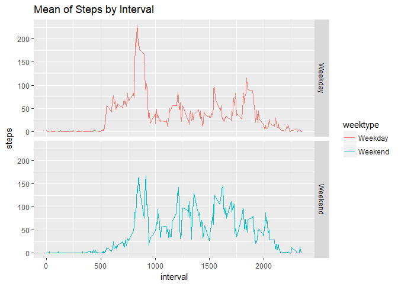

## Loading and preprocessing the data


```r
library(dplyr)
library(ggplot2)
activity <- read.csv("activity.csv")
```

## What is mean total number of steps taken per day?

Calculating the total number of steps taken per day


```r
total <- aggregate(activity$steps, by = list(activity$date), FUN = sum)
names(total)[1] <- "date"
names(total)[2] <- "steps"
```

Histogram of the total number of steps taken per day


```r
hist(total$steps,breaks = 30, main = "Total number of steps taken per day", xlab = "Steps")
```

<!-- -->

Mean of the total number of steps taken per day


```r
mean(total$steps, na.rm = TRUE)
```

```
## [1] 10766.19
```

Median of the total number of steps taken per day


```r
median(total$steps, na.rm = TRUE)
```

```
## [1] 10765
```

## What is the average daily activity pattern?

Time series plot of the 5-minute interval and the average number of steps taken, averaged across all days


```r
gint <- aggregate(activity$steps, by=list(activity$interval), FUN = mean , na.rm = TRUE)
names(gint)[1] <- "interval"
names(gint)[2] <- "steps"

plot(gint$interval,gint$steps, type = "l", ylab = "Steps", xlab = "Interval")
```

<!-- -->

The 5-minute interval, on average across all the days in the dataset, that contains the maximum number of steps


```r
print(gint[which.max(gint$steps),])
```

```
##     interval    steps
## 104      835 206.1698
```

## Imputing missing values

Total number of missing values in the dataset


```r
missval <- sum(is.na(activity))
missval
```

```
## [1] 2304
```

Creating a new dataset by replacing the missing values with the mean of the steps within the 5 minute interval


```r
newactivity <- activity %>% group_by(interval) %>%
               mutate(steps=ifelse(is.na(steps), 
               mean(steps, na.rm=TRUE), steps))
```

Histogram of the total number of steps taken each day


```r
total2 <- aggregate(newactivity$steps, by = list(newactivity$date), FUN = sum)
names(total2)[1] <- "date"
names(total2)[2] <- "steps"


hist(total2$steps,breaks = 30, main = "Total number of steps taken per day", xlab = "Steps")
```

<!-- -->

Mean of the total number of steps taken per day


```r
mean(total2$steps, na.rm = TRUE)
```

```
## [1] 10766.19
```

Median of the total number of steps taken per day


```r
median(total2$steps, na.rm = TRUE)
```

```
## [1] 10766.19
```

## Are there differences in activity patterns between weekdays and weekends?

Creating a new factor variable in the dataset with two levels - "weekday" and "weekend" indicating whether a given date is a weekday or weekend day.


```r
newactivity$weeksdays  <- weekdays(as.Date(newactivity$date))
newactivity$weektype <- ifelse(newactivity$weeksdays == "Saturday"
                        |newactivity$weeksdays == "Sunday" ,       
                        "Weekend","Weekday")
gweek <- aggregate(newactivity$steps, by=list(newactivity$weektype , newactivity$interval),
                   FUN = mean , na.rm = TRUE)
names(gweek)[1] <- "weektype"
names(gweek)[2] <- "interval"
names(gweek)[3] <- "steps"
```

5-minute interval and the average number of steps taken plot, averaged across all weekday days or weekend days


```r
ggplot(gweek, aes(x=interval, y=steps, color=weektype)) +
 geom_line() +
 facet_grid(weektype ~ .) +
 labs(title = "Mean of Steps by Interval", x = "interval", y = "steps")
```

<!-- -->
